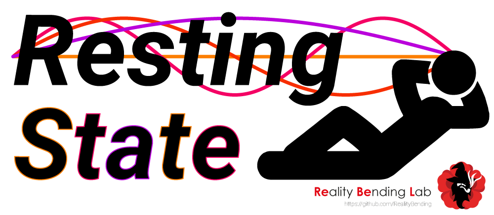
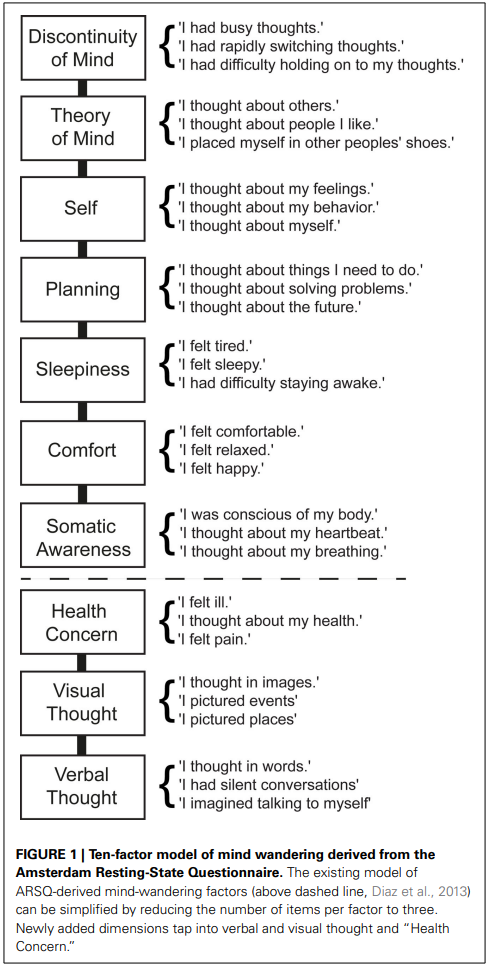
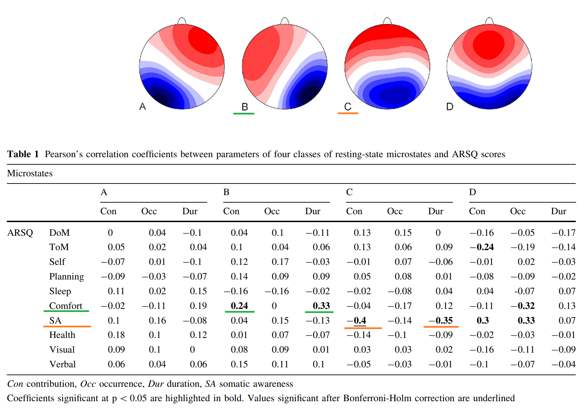

# Replicable Resting State Paradigm

 

This repository contains an open-source resting state (RS) paradigm task implemented in [jsPsych](https://www.jspsych.org/7.2/) that can be run from the browser:

- [https://realitybending.github.io/RestingState/](https://realitybending.github.io/RestingState/)

## Installation

**No installation required!** You can run it directly out-of-the box using the following [**link**](https://realitybending.github.io/RestingState/).

If you want to run it locally (e.g., to customize it):
- [**download**](https://github.com/RealityBending/RestingState/archive/refs/heads/main.zip) the whole repository
- Unzip it
- Open `index.html` in a web browser (e.g., in Chrome).

You can also edit the html file (e.g., using notepad), as well as the [**parameters.js**](parameters.js) file to easily customize things like the duration, etc.

## Features

- [x] **Eyes-closed**
  - Minimize eyes-related artifacts for EEG
  - Increase participant's comfort
- [x] **8 min**
  - Long-enough to reliably capture multimodal features
  - Can pass it by pressing *"s"*
  - [Customizable](parameters.js) duration
- [x] **Standardized post resting-state assessment**
  - Using the [ARSQ](https://www.frontiersin.org/articles/10.3389/fpsyg.2014.00271/full)
  - 21 questions, 7 dimensions (+ 2 manipulation check items)
- [x] **Customizable trigger for photosensor** (to mark events in EEG / bio devices)
- [x] An [R function](preprocessing.R) to **preprocess** and tidy-up the data
  - Load the function directly from the internet:
  - `devtools::source_url("https://raw.githubusercontent.com/RealityBending/RestingState/main/preprocessing.R")`
  - Run it on the JSON file saved at the end of the task
  - `preprocess_RS(S01_RestingState.json)`
  - Enjoy a clean data

## Citation

* Makowski, D., & Te, A. S. (2022). *My Research Software* [Computer software]. https://doi.org/10.5281/zenodo.6796255

## Scientific Background

### Eyes-closed vs. Eyes-opened

- TODO: Review arguments in favour / against.

### Duration

- TODO: Arguments for given duration
- TODO: Study about HRV + EEG Complexity + EEG Frequency indices stability

### Post RS assessment

Different questionnaires were used to assess subjective experiences and inner thoughts during resting state to potentially explore how it relates to brain and bodily activity.

- [Amsterdam Resting State Questionnaire 2.0](https://www.frontiersin.org/articles/10.3389/fpsyg.2014.00271/full) (ARSQ)
  - Short version with 3 items per scale (total items = 21)
  - We didn't keep the "new" factors to keep it short (it seems like they capture relatively less important and stable aspects of RS). However, if need be, these dimensions can be added by simply uncommenting them in the file.

### Neuro-behavioural Associations

#### EEG Microstates

[Pipinis et al. (2016)](https://link.springer.com/article/10.1007/s10548-016-0522-2) showed associations between **microstate B** and **Comfort**, and **microstate C** and **Somatic Awareness (SA)**.

#### EEG Complexity

TODO.

#### Heart Rate Variability (HRV)

TODO.

