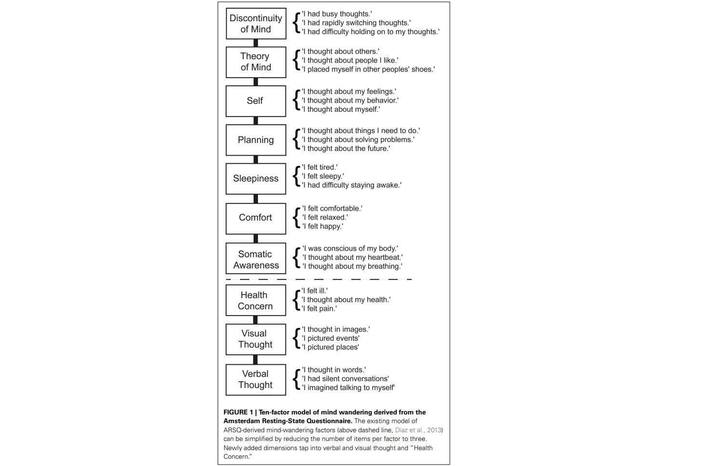

# Resting State

This repository contains a resting state (RS) paradigm task implemented in [jsPsych](https://www.jspsych.org/7.2/) that can be run from the browser:

- [https://realitybending.github.io/RestingState/](https://realitybending.github.io/RestingState/)

## Installation

**No installation required!** You can run it directly using the following [**link**](https://realitybending.github.io/RestingState/).

If you want to run it locally or edit it, you can download the whole repository and open `index.html` in your browser. You can also edit this file, as well as [*parameters.js*](parameters.js) file to customize things like the duration, etc.

## Features

- [x] Eyes closed
  - Minimize eyes-related artifacts for EEG
  - Increase participant's comfort
- [x] 8 min
  - Long-enough to reliably capture multimodal features
- [x] Standardized post resting-state assessment
  - Using the [ARSQ](https://www.frontiersin.org/articles/10.3389/fpsyg.2014.00271/full)

## Scientific Background

### Eyes-closed vs. Eyes-opened

- TODO: Review arguments in favour / against.

### Duration

- TODO: Arguments for given duration
- TODO: Study about HRV + EEG Complexity + EEG Frequency indices stability

### Post RS assessment

Different questionnaires were used to assess subjective experiences and inner thoughts during resting state to potentially explore how it relates to brain and bodily activity.

- [Amsterdam Resting State Questionnaire 2.0](https://www.frontiersin.org/articles/10.3389/fpsyg.2014.00271/full) (ARSQ)
  - Short version with 3 items per scale (total items = 21)
  - We didn't keep the "new" factors to keep it short (it seems like they capture relatively less important and stable aspects of RS). However, if need be, these dimensions can be added by simply uncommenting them in the file.

### Neuro-behavioural Associations

#### EEG Microstates

[Pipinis et al. (2016)](https://link.springer.com/article/10.1007/s10548-016-0522-2) showed associations between **microstate B** and **Comfort**, and **microstate C** and **Somatic Awareness (SA)**.

#### EEG Complexity

TODO.

#### Heart Rate Variability (HRV)

TODO.

